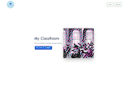

<h3 align="center">A Full Stack developer based in Southern California</h3>

I’m a developer with focus on **the MERN stack (MongoDB, Express, React, Node)**

Come visit my [website](https://www.ryanoh.io/) for more information.

<h1 align="center">Projects</h1>
<table bordercolor="#66b2b2">
  <tr>
      <td width="50%" valign="top">
        <h3 align="center">RyanOh.io</h3>
         
          
         
          

    <a href="https://github.com/ryanohcodes/personalPortfolio" target="_blank">
      Repo
    </a>|
    <a href="https://www.ryanoh.io" target="_blank">
      Website
    </a>
        

          
<strong>HTML5, CSS3, & Javascript</strong> - Responsive personal portfolio site with contact information.

      </td>
         <td width="50%" valign="top">
      <h3 align="center">ClassRoom</h3>
       
        
       
        

        <a href="https://github.com/ryanohcodes/examGuide" target="_blank">
          Repo
        </a>|
        <a href="https://classroom.cyclic.app" target="_blank">
          Website 
        </a>
            

              
<strong>HTML5, Tailwind CSS, Javascript, Express, MongoDB, Node</strong> - Responsive full-stack web application that helps users pass certification exams

    </td> 
  </tr>  
</table>

<h3 align="center">Technologies</h3>

             

<h3 align="center">Socials:</h3>

